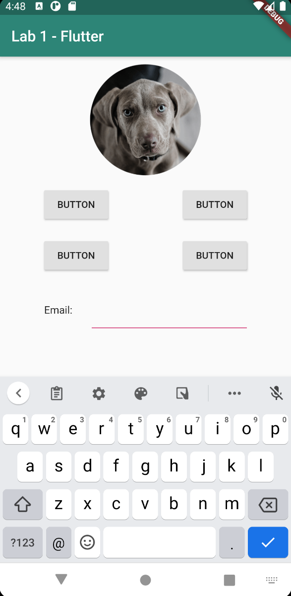
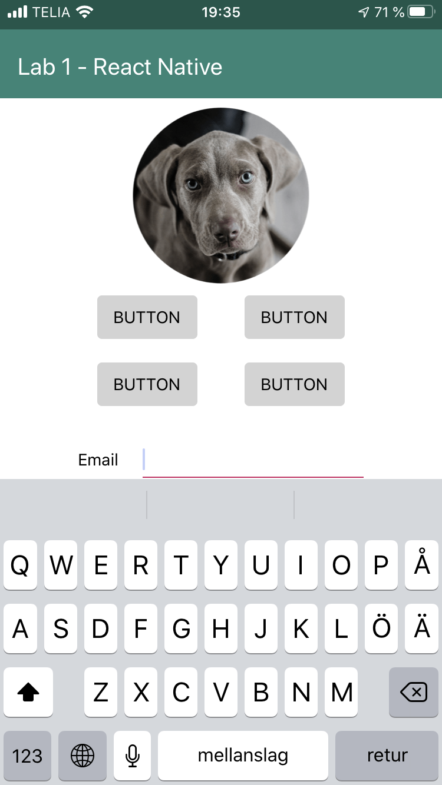

# Lab 1

The task was to declare an interface layout using [Flutter](https://flutter.dev/), [Kotlin](https://kotlinlang.org/) and [React-Native](https://reactnative.dev/). The results can be seen below:

